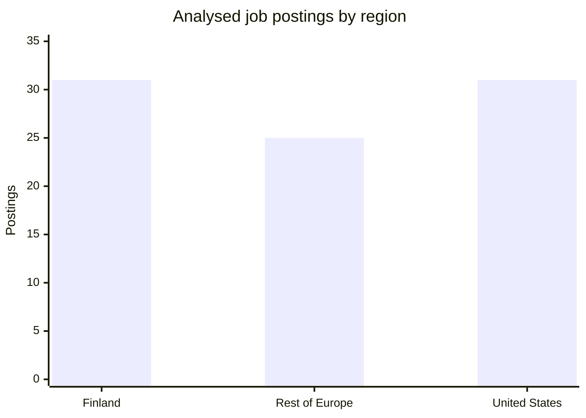
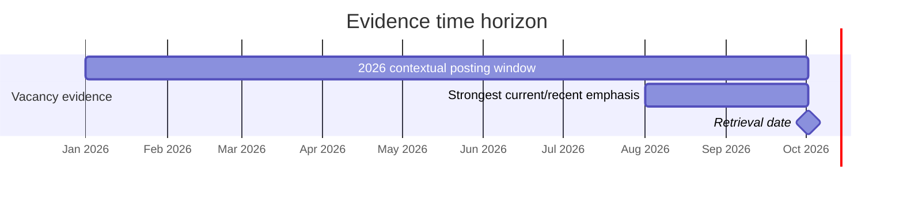

# Data, Analytics, Machine Learning and AI Job Market 2026: Finland, Rest of Europe and the United States

## Executive Summary

This study follows the labour-market-only brief supplied for the research. It analyses employer demand for data, analytics, machine-learning and artificial-intelligence professionals in **Finland, Europe excluding Finland, and the United States**, while deliberately avoiding any evaluation of curricula, courses, degrees, learning outcomes or educational programmes. fileciteturn0file0

The requested target was approximately 250–300 vacancies. The high-confidence evidence set assembled and individually audited for this report contains **87 unique job postings: 31 Finland, 25 rest of Europe and 31 United States**. I have not padded the dataset with duplicates or unverifiable vacancies to reach the target. Four records are explicitly identified as recently closed 2026 vacancies; the remainder were accessible as current/open listings or current employer listings at retrieval. **All records were retrieved or re-checked on 2 October 2026.** Consequently, the percentages below are **descriptive statistics for these 87 observations, not estimates of the whole labour market**.

The strongest finding is that the 2026 labour market does **not** support a simple story in which “AI jobs” have replaced established data, software and ML competencies. In the coded sample, employer-facing communication/stakeholder competence appears in **76/87 postings (87.4%)**, software engineering in **58/87 (66.7%)**, traditional machine learning in **45/87 (51.7%)**, Python in **43/87 (49.4%)**, data engineering/ETL in **42/87 (48.3%)**, and GenAI/LLMs in **41/87 (47.1%)**. GenAI is therefore substantial, but it coexists with rather than displaces traditional ML, data engineering and software engineering. This pattern is visible in postings from Reaktor, Futurice, Booking.com, Wise, OpenAI, Apple, Airbnb, Palantir and others. citeturn4search0turn4search1turn16search4turn17search6turn22search1turn21search1turn23search9turn24search1

**“AI Engineer” in this sample means a hybrid production-engineering role much more often than a renamed Data Scientist.** Among the 21 records normalised to AI Engineering, software engineering appears in **18/21 (85.7%)**, GenAI/LLMs in **17/21 (81.0%)**, explicit agents/agentic AI in **13/21 (61.9%)**, backend/API competence in **12/21 (57.1%)**, Python in **11/21 (52.4%)**, cloud in **11/21 (52.4%)**, traditional ML in **10/21 (47.6%)**, and data engineering in **8/21 (38.1%)**. Reaktor's LLM role combines application engineering, RAG, vector databases, evaluation, guardrails, cloud and DevOps; Nordea combines agents, Python/Java, APIs/MCP, cloud, testing, monitoring and compliance; Norrin combines agents/RAG, Azure, Python, CI/CD, MLOps, APIs and SQL; and Palantir's Forward Deployed AI Engineer combines LLMs, ML fundamentals, programming, data pipelines and customer implementation. citeturn7search0turn8search1turn28search0turn24search1

**Agentic AI is already a material competency signal but not yet a large stand-alone job-title category.** Explicit agent/agentic requirements occur in **25/87 postings (28.7%)**, yet only **1/87 (1.1%)** has an exact title containing “Agentic AI”: Citi's Lead Agentic AI Engineer. Agent requirements are much more often absorbed into AI Engineer, AI Architect, AI Developer, Data Scientist, ML Engineer or platform roles. Within the 25 explicitly agentic records, software engineering occurs in **18/25 (72.0%)**, GenAI/LLMs in **19/25 (76.0%)**, cloud in **14/25 (56.0%)**, RAG and evaluation each in **12/25 (48.0%)**, backend/APIs in **11/25 (44.0%)**, observability in **10/25 (40.0%)**, security/privacy in **9/25 (36.0%)**, and MCP and tool/function calling each in **5/25 (20.0%)**. Nordea, Vaisala, Solita and Citi provide particularly explicit examples. citeturn8search1turn26search3turn33search1turn25search3

Specific fast-moving agent frameworks are much weaker labour-market signals than the underlying architecture. LangChain/LangGraph appears in **9/87 postings (10.3%) when preferred/example mentions are included**, but in this coding those mentions are generally examples or nice-to-have technologies rather than hard requirements. MCP reaches **5/87 (5.7%) as a core requirement** and **6/87 (6.9%) including preferred mentions**; explicit multi-agent competence is only **2/87 (2.3%) core**. Employers appear to be asking more consistently for the ability to build, integrate, evaluate, secure and operate agentic systems than for allegiance to any single orchestration framework. citeturn26search3turn8search2turn33search1turn27search1

The three regional samples show different emphases, although these differences must not be interpreted as population prevalence because the sample is purposive. Finland has especially strong explicit cloud and agent signals: agents **13/31 (41.9%)**, generic cloud **17/31 (54.8%)**, AWS **15/31 (48.4%)** and Azure **14/31 (45.2%)**. In the rest-of-Europe sample, traditional ML **14/25 (56.0%)**, data engineering **13/25 (52.0%)** and software engineering **17/25 (68.0%)** are prominent. In the United States sample, software engineering reaches **26/31 (83.9%)**, GenAI/LLMs **18/31 (58.1%)**, traditional ML **17/31 (54.8%)** and data engineering **17/31 (54.8%)**. Company mix matters greatly to these differences. citeturn27search1turn26search3turn16search5turn17search6turn22search1turn23search9turn24search2

The sample is strongly senior-skewed: **52/87 (59.8%)** records map to senior-level and another **22/87 (25.3%)** to staff/lead/principal categories; only **4/87 (4.6%)** are clear entry/junior examples. Meaningful early-career pathways nevertheless exist: KONE advertised a graduate/trainee People Insights role, AMAI a Junior Machine Learning Engineer, Medtronic an AI/Data Science Engineer I, and Boeing an Associate Engineering Data Scientist. citeturn26search4turn19search0turn19search1turn32search7

The broader official statistics are consistent with continued demand for digital specialists, but they should be kept separate from the vacancy sample. Statistics Finland reported **29,600 total job vacancies across the Finnish economy in Q2 2026**, up 2% year-on-year, with 12,800 in Helsinki-Uusimaa; these are all-sector figures, not data/AI counts. citeturn34search0turn34search1 Eurostat reported **10.45 million ICT specialists in the EU in 2025, 5.0% of total employment**, with Finland at 7.8% and Sweden at 8.9%. citeturn34search2turn34search3 In the United States, the BLS reported a 33.5% projected increase in data-scientist employment over 2024–34, while its newer 2025–35 projections put software-developer employment growth at 10%. citeturn34search7turn34search6

## Objectives, Scope and Methodology

**Research objective.** The analysis asks what employers actually call data/analytics/ML/AI jobs in 2026; which competencies they explicitly request; how those competencies cluster by role; how Finland, Europe excluding Finland and the USA differ; what “AI Engineer” now means in practice; whether agentic AI is becoming a distinct occupation; which requirements look cross-role and durable; and which appear emerging, specialised or framework-specific. These objectives follow the supplied specification. fileciteturn0file0

**Unit of analysis and sample.** One record represents one unique employer vacancy. Multi-location versions of the same vacancy are treated as one posting rather than replicated by city. The analytical sample contains 87 records.

| Region | Count | Denominator | Share |
|---|---:|---:|---:|
| Finland | 31 | 87 | 35.6% |
| Rest of Europe | 25 | 87 | 28.7% |
| United States | 31 | 87 | 35.6% |
| **Total** | **87** | **87** | **100.0%** |

The sample is intentionally useful for **cross-role and cross-region comparison**, not proportional to the true size of the three labour markets. No regional market share should therefore be inferred from the 31/25/31 split.

**Evidence hierarchy.** Primary employer career sites and employer ATS systems were preferred. Search engines were used primarily for discovery and retrieval. The individual evidence base includes direct Apple, OpenAI, Airbnb, Palantir, Salesforce, Citi, Walmart and Boeing postings in the USA; direct employer/ATS postings from Booking.com, Wise, Zalando, Delivery Hero and Solita in Europe; and Reaktor, Futurice, Nordea, Vaisala, Solita, Norrin and others in Finland. citeturn21search1turn22search1turn23search8turn24search1turn25search4turn32search5turn16search5turn17search4turn26search3turn28search0

The official second evidence layer uses Statistics Finland, Eurostat and the US Bureau of Labor Statistics rather than generic career articles. Eurostat's experimental online-job-advertisement dataset is especially relevant for future extension because it was updated on 26 August 2026 and covered data through 2026 Q2. citeturn34search4

**Collection and coding workflow.**

**Evidence time window.** Current/open October postings and recent 2026 vacancies were prioritised. Four recently closed 2026 postings were retained because they add material evidence on seniority and emerging role definitions and are explicitly marked as closed rather than silently treated as active.

**Required versus preferred.** The coding deliberately does not convert every technology named in a vacancy into a mandatory requirement. “Core” in the frequency analysis means a technology or competency that is either explicitly required or clearly central to the stated responsibilities. Items labelled “nice to have”, “plus”, “advantage”, “preferred”, or offered merely as examples are separately retained as preferred signals. For example, Norrin's Data Engineer explicitly requires SQL, Python, PySpark, Databricks/Fabric and production ETL/ELT, while Snowflake, dbt, GenAI/MLOps and Terraform are listed as nice-to-have capabilities. citeturn31view1

**Normalisation.** Different wording was mapped to a stable taxonomy while preserving meaningful distinctions. “Amazon Web Services” maps to AWS; “large language models” to GenAI/LLMs; “retrieval augmented generation” to RAG; and “vector search” and “vector database” remain separate from RAG but also contribute to the wider retrieval category. “AI agents” and “agentic systems” map to Agents/Agentic AI, but generic LLM use does not. MCP is coded independently. Evaluation is also kept distinct from agents. This prevents all GenAI vacancies being misclassified as agentic vacancies.

**Important denominator rule.** Every percentage in this report states its denominator. Overall tables use 87; region tables use 31/25/31; role-family tables use the corresponding family count. Missing or unstated skills are treated as **not explicitly observed**, not as evidence that an employer rejects the skill. Frequencies are therefore best viewed as explicit-employer-signal rates and often as lower bounds.

## Dataset, Job Titles and Role Families

The normalised family distribution shows that the analytical sample spans established and emerging categories rather than being constructed only around fashionable GenAI titles.

| Normalised family | Count | Denominator | Share |
|---|---:|---:|---:|
| Machine Learning Engineering | 24 | 87 | 27.6% |
| AI Engineering | 21 | 87 | 24.1% |
| Data Science | 19 | 87 | 21.8% |
| Data Engineering | 9 | 87 | 10.3% |
| AI Platform / Infrastructure | 6 | 87 | 6.9% |
| GenAI / LLM | 2 | 87 | 2.3% |
| MLOps / ML Platform | 2 | 87 | 2.3% |
| Data & Analytics | 1 | 87 | 1.1% |
| Analytics Engineering | 1 | 87 | 1.1% |
| Agentic AI | 1 | 87 | 1.1% |
| Other emerging AI | 1 | 87 | 1.1% |

By region, the sample composition is:

| Role family | Finland | Rest of Europe | USA | Total |
|---|---:|---:|---:|---:|
| ML Engineering | 6 | 7 | 11 | 24 |
| AI Engineering | 11 | 4 | 6 | 21 |
| Data Science | 4 | 8 | 7 | 19 |
| Data Engineering | 5 | 1 | 3 | 9 |
| AI Platform / Infrastructure | 1 | 3 | 2 | 6 |
| GenAI / LLM | 1 | 1 | 0 | 2 |
| MLOps / ML Platform | 1 | 0 | 1 | 2 |
| Data & Analytics | 1 | 0 | 0 | 1 |
| Analytics Engineering | 0 | 1 | 0 | 1 |
| Agentic AI | 0 | 0 | 1 | 1 |
| Other emerging AI | 1 | 0 | 0 | 1 |

**Actual title language is considerably messier than the normalised families.** The following counts are overlapping text patterns rather than mutually exclusive categories.

| Observed title pattern | Count | Denominator | Share |
|---|---:|---:|---:|
| “Machine Learning Engineer” / “ML Engineer” | 27 | 87 | 31.0% |
| “Data Scientist” | 15 | 87 | 17.2% |
| Title explicitly containing “AI Engineer” | 9 | 87 | 10.3% |
| “Data Engineer” | 8 | 87 | 9.2% |
| Platform / Infrastructure in title | 7 | 87 | 8.0% |
| “Forward Deployed” | 4 | 87 | 4.6% |
| “AI Architect” | 2 | 87 | 2.3% |
| LLM / Generative AI explicitly in title | 2 | 87 | 2.3% |
| “Analytics Engineer” | 1 | 87 | 1.1% |
| “Agentic AI” explicitly in title | 1 | 87 | 1.1% |

The practical meaning of a title therefore has to be inferred from responsibilities. Apple's “Machine Learning Engineer, Proactive” combines transformer/foundation-model work with embeddings, retrieval, reranking and RAG; Airbnb's Query Intelligence MLE spans natural-language understanding, high-scale data pipelines, APIs, model development and experimentation; and Smartly's “Senior Machine Learning Engineer, AI Platform” incorporates platform, MLOps and multimodal ML concerns. citeturn21search1turn23search9turn5search0

“Data Scientist” remains equally heterogeneous. Booking.com's performance-marketing role combines statistics, experimentation, optimisation, ML, Python, SQL, Spark and GCP; Wise's Pricing Lead Data Scientist emphasises experimentation, causal inference and pricing models; Norrin's Data Scientist is centred on mathematical optimisation while also allowing ML, MLOps, computer vision, LLMs and agents; AbbVie's Data Scientist combines healthcare-domain reasoning, SQL, R/Python, statistics, ML and visualisation. citeturn16search4turn17search2turn31view2turn25search7

Several **emerging titles** deserve monitoring because they signal changing competency combinations even when each is individually rare.

| Emerging title pattern / example | Sample count | Denominator | Interpretation |
|---|---:|---:|---|
| Forward Deployed AI Engineer / Scientist / Engineering | 4 | 87 | Customer-embedded AI implementation bridging engineering, modelling and business |
| AI Platform Engineer / AI infrastructure variants | 6-family sample | 87 | AI runtime, serving, MLOps, distributed systems, reliability |
| AI Full-Stack Developer | 1 | 87 | Software-engineering-led AI application development |
| Sovereign AI Model Engineer | 1 | 87 | Model development, fine-tuning, evaluation and deployment under specialised constraints |
| Principal AI Architect | 1 | 87 | Enterprise agent/RAG architecture, evaluation, integration and AI Ops |
| AI Designer | 1 | 87 | Human/business/service design around AI adoption rather than a conventional engineering role |
| Lead Agentic AI Engineer | 1 | 87 | Explicit agentic systems as a stand-alone engineering title |
| Platform Intelligence Engineer | 1 | 87 | Data-platform and analytics engineering blended around operational intelligence |

Examples are visible at Nordea, Solita, NestAI, Vaisala, Citi and Palantir. citeturn8search2turn27search0turn10search0turn26search3turn25search3turn24search0

**Seniority distribution** reinforces the strongly experienced profile of the present market sample.

| Seniority group | Count | Denominator | Share |
|---|---:|---:|---:|
| Entry / junior | 4 | 87 | 4.6% |
| Mid | 9 | 87 | 10.3% |
| Senior | 52 | 87 | 59.8% |
| Staff / lead / principal | 22 | 87 | 25.3% |

This is particularly pronounced among emerging AI families. Of the 30 records classified as AI Engineering, GenAI/LLM, Agentic AI or AI Platform/Infrastructure, **28/30** are senior or staff/lead/principal under the report's title-based mapping; only two are clearly below that level. This should not be taken as proof that junior AI employment is absent—only that clearly junior production-AI advertisements are scarce in this purposive sample. The explicit junior counterexamples at KONE, AMAI, Medtronic and Boeing are therefore analytically important. citeturn26search4turn19search0turn19search1turn32search7

## Skills, Technologies and Role-Family Findings

**Overall explicit core-skill landscape**

| Normalised competency | Count | Denominator | Share |
|---|---:|---:|---:|
| Communication / stakeholder / client work | 76 | 87 | 87.4% |
| Software engineering | 58 | 87 | 66.7% |
| Traditional machine learning | 45 | 87 | 51.7% |
| Python | 43 | 87 | 49.4% |
| Data engineering / ETL / ELT | 42 | 87 | 48.3% |
| GenAI / LLMs | 41 | 87 | 47.1% |
| Cloud | 33 | 87 | 37.9% |
| Evaluation / LLM evaluation | 31 | 87 | 35.6% |
| Agents / agentic AI | 25 | 87 | 28.7% |
| Monitoring / observability | 24 | 87 | 27.6% |
| Governance / responsible AI | 22 | 87 | 25.3% |
| AWS | 21 | 87 | 24.1% |
| Deep learning | 20 | 87 | 23.0% |
| Backend / APIs | 19 | 87 | 21.8% |
| MLOps | 19 | 87 | 21.8% |
| Statistics | 18 | 87 | 20.7% |
| Security / privacy | 17 | 87 | 19.5% |
| SQL | 16 | 87 | 18.4% |
| Azure | 15 | 87 | 17.2% |
| CI/CD | 15 | 87 | 17.2% |
| Model serving / inference | 15 | 87 | 17.2% |
| Domain expertise | 15 | 87 | 17.2% |
| RAG | 13 | 87 | 14.9% |
| GCP | 12 | 87 | 13.8% |

The central production-engineering signal is particularly clear in ML Engineering. Among **24 ML Engineering postings**, software engineering occurs in **22/24 (91.7%)**, communication/stakeholder work in **21/24 (87.5%)**, traditional ML in **18/24 (75.0%)**, evaluation in **14/24 (58.3%)**, deep learning and GenAI each in **12/24 (50.0%)**, data engineering in **11/24 (45.8%)**, Python in **11/24 (45.8%)**, and MLOps in **9/24 (37.5%)**. Jobs at Apple, OpenAI, Airbnb, DoorDash, Smartly, NestAI and Delivery Hero all reinforce the idea that ML engineering is fundamentally about turning models into reliable production systems rather than modelling alone. citeturn21search1turn22search1turn23search9turn23search3turn5search0turn10search1turn18search4

**Major role-family skill profiles**

| Role family | High-frequency explicit competencies |
|---|---|
| **ML Engineering (n=24)** | Software engineering 22/24 (91.7%); communication 21/24 (87.5%); traditional ML 18/24 (75.0%); evaluation 14/24 (58.3%); deep learning 12/24 (50.0%); GenAI 12/24 (50.0%); data engineering 11/24 (45.8%); Python 11/24 (45.8%) |
| **AI Engineering (n=21)** | Software engineering 18/21 (85.7%); GenAI 17/21 (81.0%); communication 17/21 (81.0%); agents 13/21 (61.9%); backend/APIs 12/21 (57.1%); Python 11/21 (52.4%); cloud 11/21 (52.4%); traditional ML 10/21 (47.6%) |
| **Data Science (n=19)** | Communication 18/19 (94.7%); statistics 15/19 (78.9%); traditional ML 15/19 (78.9%); Python 11/19 (57.9%); data engineering 9/19 (47.4%); evaluation 7/19 (36.8%); GenAI 5/19 (26.3%) |
| **Data Engineering (n=9)** | Data engineering/ETL 9/9 (100%); data modelling 9/9 (100%); communication 9/9 (100%); cloud 5/9 (55.6%); Databricks 5/9 (55.6%); warehouse/lakehouse 4/9 (44.4%); Python 3/9 (33.3%); SQL 3/9 (33.3%) |
| **AI Platform / Infrastructure (n=6)** | Software engineering 5/6 (83.3%); communication 5/6 (83.3%); cloud 4/6 (66.7%); observability 4/6 (66.7%); GenAI 3/6 (50.0%); MLOps 3/6 (50.0%) |

The Data Science evidence strongly contradicts the idea that statistics has disappeared from modern AI-intensive employers. Booking.com explicitly asks for statistical and experimental skills, Wise's pricing role centres experimentation and causal inference, Norrin emphasises linear algebra/statistical analysis and mathematical optimisation, and AbbVie asks for survival analysis, hypothesis testing, regression and ML. citeturn16search4turn17search2turn31view2turn25search7

Data Engineering remains differentiated from AI Engineering. Norrin's current Data Engineer requires scalable data pipelines, SQL, Python, PySpark, Azure, Databricks/Fabric, ETL/ELT, warehousing and modelling; Solita's Senior Data Engineer emphasises batch/streaming pipelines, cloud, Databricks/Snowflake and modelling; Zalando emphasises SQL transformations, models, Databricks/AWS, dbt, tests and data contracts. GenAI may consume these platforms, but the underlying role remains recognisably about data architecture and reliable data products. citeturn31view1turn26search7turn16search0

**Technology and platform signals**

| Technology / ecosystem | Core count | Denominator | Core share | Including preferred/example signals |
|---|---:|---:|---:|---:|
| Python | 43 | 87 | 49.4% | ~50% |
| AWS | 21 | 87 | 24.1% | 24.1% |
| Azure | 15 | 87 | 17.2% | higher when preferred mentions included |
| SQL | 16 | 87 | 18.4% | ~19% |
| CI/CD | 15 | 87 | 17.2% | 17.2% |
| GCP | 12 | 87 | 13.8% | higher with preferred cloud mentions |
| Java | 8 | 87 | 9.2% | 12/87 (13.8%) including preferred |
| PyTorch / TensorFlow / JAX | 8 | 87 | 9.2% | 14/87 (16.1%) including preferred |
| Databricks | 7 | 87 | 8.0% | 8/87 (9.2%) including preferred |
| Infrastructure as code / Terraform | 7 | 87 | 8.0% | 9/87 (10.3%) including preferred |
| MCP | 5 | 87 | 5.7% | 6/87 (6.9%) including preferred |
| Docker | 5 | 87 | 5.7% | 6/87 (6.9%) including preferred |
| Spark | 5 | 87 | 5.7% | 5.7% |
| Snowflake | 4 | 87 | 4.6% | 5/87 (5.7%) including preferred |
| dbt | 4 | 87 | 4.6% | 5/87 (5.7%) including preferred |
| Kubernetes | 3 | 87 | 3.4% | 3.4% |
| R | 3 | 87 | 3.4% | 3.4% |
| LangChain / LangGraph | 0 hard/core coded | 87 | 0.0% | 9/87 (10.3%) as examples/preferred |

Platform frequencies are particularly sensitive to sample composition. Finland's consultancy, banking and industrial postings name Azure/AWS/GCP explicitly much more often than the US research/product postings, which frequently describe “cloud”, distributed systems, model serving or internal infrastructure without naming a public-cloud provider. Direct comparisons of vendor percentages should therefore be treated cautiously. Reaktor, Solita, Norrin and Vaisala are unusually explicit about cloud vendors, while OpenAI and Palantir more often describe infrastructure capabilities. citeturn4search0turn27search1turn31view1turn26search3turn22search1turn24search2

**GenAI and LLM competencies**

| Skill | Core count | Denominator | Core share | Any explicit mention incl. preferred |
|---|---:|---:|---:|---:|
| GenAI / LLMs | 41 | 87 | 47.1% | 46/87 (52.9%) |
| Evaluation / LLM evaluation* | 31 | 87 | 35.6% | 32/87 (36.8%) |
| Agents / agentic AI | 25 | 87 | 28.7% | 27/87 (31.0%) |
| RAG | 13 | 87 | 14.9% | 13/87 (14.9%) |
| Fine-tuning / post-training | 7 | 87 | 8.0% | 10/87 (11.5%) |
| Prompt engineering | 6 | 87 | 6.9% | 6/87 (6.9%) |
| Vector search / vector database | 5 | 87 | 5.7% | 5/87 (5.7%) |
| Tool/function calling | 5 | 87 | 5.7% | 5/87 (5.7%) |
| MCP | 5 | 87 | 5.7% | 6/87 (6.9%) |
| Embeddings | 3 | 87 | 3.4% | 3/87 (3.4%) |
| Multi-agent systems | 2 | 87 | 2.3% | 4/87 (4.6%) |
| LLMOps / AI Ops | 2 | 87 | 2.3% | 2/87 (2.3%) |

\*The evaluation category deliberately includes both traditional model evaluation and explicit LLM evaluation; it must not be read as 31 dedicated LLM-evaluation vacancies.

**Skill combinations** show why isolated keyword counts can be misleading.

| Combination | Count | Denominator | Share |
|---|---:|---:|---:|
| Traditional ML + software engineering | 29 | 87 | 33.3% |
| Python + cloud | 21 | 87 | 24.1% |
| Software engineering + cloud | 21 | 87 | 24.1% |
| LLM + agents | 19 | 87 | 21.8% |
| Data engineering + cloud | 14 | 87 | 16.1% |
| LLM + backend/API engineering | 14 | 87 | 16.1% |
| LLM + RAG | 12 | 87 | 13.8% |
| Agents + evaluation | 12 | 87 | 13.8% |
| Python + SQL | 11 | 87 | 12.6% |
| Agents + observability | 10 | 87 | 11.5% |
| Agents + security/privacy | 9 | 87 | 10.3% |
| LLM + RAG + evaluation | 8 | 87 | 9.2% |
| ML + cloud + MLOps | 6 | 87 | 6.9% |
| Agents + tool/function calling | 5 | 87 | 5.7% |

This combination analysis is one of the clearest indicators of role evolution: employers are not simply adding “LLM” to old job descriptions. They are combining LLMs with application engineering, APIs, retrieval, evaluation, cloud and operational controls. Reaktor, Nordea, Vaisala, Solita, Palantir and Citi provide direct examples of these composite stacks. citeturn7search0turn8search1turn26search3turn33search1turn24search1turn25search4

## Regional, Seniority and Emerging-AI Analysis

**Regional comparison of explicit core mentions**

| Competency | Finland, n=31 | Rest of Europe, n=25 | USA, n=31 |
|---|---:|---:|---:|
| Python | 17/31 (54.8%) | 13/25 (52.0%) | 13/31 (41.9%) |
| SQL | 5/31 (16.1%) | 8/25 (32.0%) | 3/31 (9.7%) |
| Software engineering | 15/31 (48.4%) | 17/25 (68.0%) | 26/31 (83.9%) |
| Traditional ML | 14/31 (45.2%) | 14/25 (56.0%) | 17/31 (54.8%) |
| Data engineering / ETL | 12/31 (38.7%) | 13/25 (52.0%) | 17/31 (54.8%) |
| Statistics | 5/31 (16.1%) | 7/25 (28.0%) | 6/31 (19.4%) |
| GenAI / LLMs | 12/31 (38.7%) | 11/25 (44.0%) | 18/31 (58.1%) |
| RAG | 7/31 (22.6%) | 3/25 (12.0%) | 3/31 (9.7%) |
| Agents / agentic AI | 13/31 (41.9%) | 3/25 (12.0%) | 9/31 (29.0%) |
| Evaluation | 13/31 (41.9%) | 8/25 (32.0%) | 10/31 (32.3%) |
| MLOps | 8/31 (25.8%) | 8/25 (32.0%) | 3/31 (9.7%) |
| Generic cloud | 17/31 (54.8%) | 10/25 (40.0%) | 6/31 (19.4%) |
| Monitoring / observability | 10/31 (32.3%) | 5/25 (20.0%) | 9/31 (29.0%) |
| Security / privacy | 7/31 (22.6%) | 2/25 (8.0%) | 8/31 (25.8%) |
| Governance / responsible AI | 8/31 (25.8%) | 3/25 (12.0%) | 11/31 (35.5%) |

These figures should not be interpreted as claims that, for example, Azure is objectively more important in Finland or that Americans require less SQL. The sample compositions differ. Finland contains many consultancies and enterprise transformation roles where cloud vendors are explicitly named; the US sample contains more large-product-company and model-platform jobs; Europe contains a particularly strong Data Science/FinCrime/marketplace component. The table is evidence about the sample, not a weighted regional census.

**Finland.** The strongest qualitative pattern is the convergence of AI engineering, cloud engineering and enterprise integration. Reaktor's LLM developer role includes RAG, embeddings, vector databases, guardrails, evaluation, cloud, Docker/Kubernetes and DevOps. Nordea's AI Engineer explicitly combines Azure/Power Platform, AWS, Python/Java, API/MCP integrations, guardrails, testing, monitoring and governance. Vaisala's Principal AI Architect specifies RAG, embeddings, vector search, agent orchestration, memory, MCP/tool calling, evaluation, CI/CD and monitoring, while Norrin combines agents, RAG, Azure AI Foundry, Python, CI/CD, MLOps and APIs. citeturn7search0turn8search1turn26search3turn28search0

Finland also retains strong traditional specialisms. NestAI advertises computer-vision and model-engineering positions around object tracking, re-identification, action recognition, pretraining/fine-tuning, evaluation and constrained deployment; Brightly Works seeks industrial AI/ML competence spanning classical ML, time series, MLOps, Databricks/Snowflake and monitoring; Norrin's Data Scientist emphasises mathematical optimisation and statistics rather than LLM application development. citeturn10search0turn10search1turn10search2turn6search3turn31view2

**Rest of Europe.** The European sample is heterogeneous. The UK records from Wise emphasise regulated financial applications, experiment design, causal inference, model lifecycle, ML platforms, LLM evaluation, human review and governance. citeturn17search0turn17search2turn17search4turn17search6 The Netherlands sample from Booking.com spans classical marketplace ML, experimentation and optimisation through to explicit LLM fine-tuning, inference optimisation and production-scale agents. citeturn16search4turn16search5turn19search4 Sweden shows a particularly explicit software-engineering interpretation of applied AI: Solita's AI Software Developer and Lead AI Developer combine RAG/agents with cloud, DevSecOps, IaC, APIs, MCP and backend engineering, whereas its Analytics Engineer remains focused on data warehouses, modelling, pipelines, Python and SQL. citeturn33search0turn33search1turn35view5

**United States.** The US sample has the strongest explicit software-engineering signal. Apple's current MLE work combines foundation models, fine-tuning, semantic retrieval, embeddings, ranking and on-device deployment; OpenAI's API Multicloud MLE combines post-training, evaluation, data pipelines, APIs, distributed systems and infrastructure; Palantir's model-infrastructure engineering adds Docker/Kubernetes, GPU inference, deployment pipelines, observability and security; Stripe's Growth Platform MLE owns models from feature development and training through evaluation, deployment and monitoring. citeturn21search1turn22search1turn24search2turn23search6

The US also provides some of the clearest explicit evidence of agentic-title emergence. Citi's Lead Agentic AI Engineer describes production-grade systems at the intersection of LLMs, RAG, full-stack engineering and multi-agent platforms, while its Global Rates AI Engineer asks for GenAI, RAG, agentic frameworks, Python, SQL and production application engineering. Salesforce is simultaneously building agent-oriented knowledge-graph infrastructure and AI research around enterprise agents. citeturn25search3turn25search4turn24search6turn24search4

**What does “AI Engineer” mean in 2026?** On this evidence, its centre of gravity is:

**software/backend engineering + LLM application engineering + integration/APIs + cloud/production practices**, with traditional ML knowledge often present but not sufficient by itself.

That conclusion follows from the 21-job AI Engineering family rather than from title intuition: SWE 18/21, GenAI 17/21, agents 13/21, backend/APIs 12/21, cloud 11/21, Python 11/21, traditional ML 10/21, data engineering 8/21 and RAG 7/21. Reaktor, Nordea, Norrin, Solita, Palantir, Citi and AbbVie all illustrate different variants of this stack. citeturn7search0turn8search1turn28search0turn27search0turn24search1turn25search4turn25search9

There is nevertheless **no single standard AI Engineer definition**. At 3stepIT-like enterprise contexts the concept leans toward cloud and AI integration; at financial institutions it adds controls, APIs and governance; at consulting firms it combines client-facing solution architecture and software delivery; at pharmaceutical firms it can combine LLMs, backend APIs and domain-specific AI. The title should therefore not be analysed independently of its competency bundle. Similar heterogeneity is visible in current Finland and US postings. citeturn28search0turn8search1turn25search4turn25search9

**Agentic AI.** The evidence favours the interpretation that agentic capability is presently being **absorbed into broader AI roles faster than “Agentic AI Engineer” is becoming a dominant independent occupation**. Only one sample title explicitly says Agentic AI Engineer, versus 25 jobs with explicit agent competence. Finland's Nordea AI Engineer uses MCP integrations and AI agents; Vaisala asks its Principal AI Architect to define agent orchestration, memory and MCP/tool-calling patterns; Solita's AI Lead Developer builds agents and MCP servers; Reaktor's LLM Developer includes agentic software development. citeturn8search1turn26search3turn33search1turn7search0

Within those **25 explicit-agent postings**:

| Agent-stack competency | Count | Denominator | Share |
|---|---:|---:|---:|
| GenAI / LLM | 19 | 25 | 76.0% |
| Software engineering | 18 | 25 | 72.0% |
| Cloud | 14 | 25 | 56.0% |
| RAG | 12 | 25 | 48.0% |
| Evaluation | 12 | 25 | 48.0% |
| Backend / APIs | 11 | 25 | 44.0% |
| Monitoring / observability | 10 | 25 | 40.0% |
| Security / privacy | 9 | 25 | 36.0% |
| Tool/function calling | 5 | 25 | 20.0% |
| MCP | 5 | 25 | 20.0% |
| Guardrails | 4 | 25 | 16.0% |
| Explicit multi-agent systems | 2 | 25 | 8.0% |

This is important because it shows that employer demand for “agents” is not usually a request for prompt writing alone. The observed production stack surrounds the agent with engineering, retrieval, evaluation, integration, monitoring and increasingly security/governance.

**Foundational versus emerging competencies**

| Analytical class | Evidence-based interpretation |
|---|---|
| **Foundational / cross-role** | Communication/stakeholder work 76/87; software engineering 58/87; traditional ML 45/87; Python 43/87; data engineering 42/87. These recur across several regions and families. |
| **Role-specific** | Statistics is particularly concentrated in Data Science: 15/19 (78.9%). Data modelling is universal in the nine coded Data Engineering records. Deep learning/CV/NLP/recommendation are more concentrated in ML and specialised model roles. |
| **Platform / production** | Cloud 33/87; observability 24/87; MLOps 19/87; CI/CD 15/87; model serving 15/87; security/privacy 17/87. |
| **Emerging but material** | GenAI/LLM 41/87; agents 25/87; RAG 13/87; MCP 5/87; explicit multi-agent 2/87. |
| **Fast-moving / framework-specific** | LangChain/LangGraph, LlamaIndex and similar frameworks occur, but typically as examples or preferred technologies rather than universal hard requirements. |
| **Specialised / niche** | Computer vision, recommendation/ranking, industrial time series, mathematical optimisation, graph ML, multimodal perception, healthcare/pharma expertise and financial-crime expertise cluster in narrower role groups. |

The most defensible distinction between “durable” and “tool-specific” signals is therefore not old versus new. It is **capability versus implementation choice**. Software engineering, data modelling, APIs, evaluation, system integration, statistics, experimentation, deployment, monitoring and security are expressed across many employers and technology stacks. In contrast, a specific agent framework or vector database usually appears as one implementation option among several. Apple's retrieval stack, Vaisala's architecture role, Nordea's MCP integrations and Solita's framework examples all illustrate this distinction. citeturn21search1turn26search3turn8search1turn33search1

## Structured Job-Posting Evidence Appendix and Skill Taxonomy

All rows below have a common **retrieval date of 2 October 2026** unless explicitly noted. “Core evidence” means explicitly required competence or a technology central to the advertised responsibilities; it does **not** mean every item was written by the employer under a heading literally called “required”. “Preferred” preserves nice-to-have/example signals separately.

Normalised-skill codes used below are: **PY** Python; **SQL** SQL; **SWE** software engineering; **DE** data engineering/ETL; **DM** data modelling; **WH** warehouse/lakehouse; **STAT** statistics; **ML** traditional ML; **DL** deep learning; **NLP** NLP; **CV** computer vision; **GEN** GenAI/LLMs; **RAG** retrieval-augmented generation; **EMB** embeddings; **VEC** vector search/database; **AGT** agents; **TOOL** tool/function calling; **MCP** Model Context Protocol; **MAG** multi-agent; **EVAL** evaluation; **GRD** guardrails; **API** backend/APIs; **INT** systems integration; **DIST** distributed systems; **AWS/AZ/GCP** cloud providers; **DBX** Databricks; **SNOW** Snowflake; **DKR/K8S** Docker/Kubernetes; **CICD** CI/CD; **IAC** infrastructure as code; **MLOPS/LLOPS** ML/LLM Ops; **SERV** model serving; **OBS** monitoring/observability; **TEST** testing; **SEC** security/privacy; **GOV** governance/responsible AI; **COMM** communication/stakeholder; **EXP** experimentation; **CAUS** causal inference; **REC** ranking/recommendation; **OPT** optimisation; **TS** time series; **BI** BI/visualisation.

**Finland evidence records**

| ID | Exact title | Family | Company | Country | Region | Location | Seniority | Experience | Post date/status | Core evidence | Preferred-only | Normalised skills | Source |
|---|---|---|---|---|---|---|---|---|---|---|---|---|---|
| F01 | Machine Learning Engineer | ML Engineering | Reaktor | Finland | Finland | Helsinki | Mid | ~3+ yrs | Current; date n/s | Python, SQL, ML, cloud, IaC, software engineering | Java/JS/TS/C++ | PY,SQL,ML,SWE,AWS,AZ,GCP,IAC,COMM | citeturn4search0 |
| F02 | AI Developer – LLM Applications | GenAI/LLM | Reaktor | Finland | Finland | Helsinki | Mid/Senior | Production AI software | Current | LLMs, RAG, embeddings/vector DB, prompts, evaluation, guardrails, agents, cloud, Docker/K8s, CI/CD | Node/TS, LangChain, LlamaIndex | PY,GEN,RAG,EMB,VEC,EVAL,GRD,AGT,SWE,API,AWS,AZ,GCP,DKR,K8S,CICD,TEST,SEC,GOV | citeturn7search0 |
| F03 | Senior AI Engineer | AI Engineering | Futurice | Finland | Finland | Helsinki/Tampere | Senior | 5+ yrs | 2026 | ML/GenAI, fine-tuning, agents/tool use, backend/APIs, data pipelines, cloud, monitoring | LangChain/LangGraph; DL frameworks | PY,GEN,AGT,TOOL,EVAL,SWE,API,DE,AWS,AZ,GCP,OBS,MLOPS,GOV,COMM | citeturn4search1 |
| F04 | Data Engineer | Data Engineering | Futurice | Finland | Finland | Helsinki/Tampere | Mid | Few yrs | 2026 | Pipelines/platforms, cloud data services, databases, Python/Java, CI/Terraform | Model fine-tuning/MLOps | PY,DE,DM,WH,AWS,AZ,DBX,CICD,IAC,COMM | citeturn11search4 |
| F05 | Senior Machine Learning Engineer, AI Platform | MLOps/ML Platform | Smartly | Finland | Finland | Helsinki | Senior | Senior | Current | Production ML, MLOps/data platform, multimodal ML, cloud, security/monitoring | Java/C++; MLflow/Kubeflow | PY,ML,DL,NLP,CV,MLOPS,DE,AWS,GCP,SEC,OBS,SWE | citeturn5search0 |
| F06 | Senior Data Scientist | Data Science | Smartly | Finland | Finland | Helsinki | Senior | 5+ yrs; 2+ cloud | Current | Statistics/maths, Python, ML/DL, AWS/GCP, MLOps, model evaluation/monitoring | Java/C++; framework tooling | PY,STAT,ML,DL,AWS,GCP,MLOPS,EVAL,OBS,COMM | citeturn5search1 |
| F07 | AI/ML Engineer | AI Engineering | Recordly | Finland | Finland | Finland hybrid/remote | Senior | Senior indicated | c. 2026 Q3 | Production AI/ML/GenAI, SQL, agentic systems, RAG | — | SQL,ML,GEN,AGT,RAG,SWE,COMM | citeturn10search5 |
| F08 | Senior AI/ML Engineer | AI Engineering | Recordly | Finland | Finland | Finland hybrid/remote | Senior | 5+ yrs | c. 2026 Q3 | End-to-end AI/ML/GenAI, technical advisory, high-trust environments | — | ML,GEN,SWE,GOV,COMM | citeturn11search0 |
| F09 | Data Engineer | Data Engineering | Recordly | Finland | Finland | Finland hybrid/remote | Mid | Few yrs | c. 2026 Q3 | Data pipelines/platforms/models; Snowflake+dbt; Databricks | — | DE,DM,SNOW,DBX,SQL,COMM | citeturn11search1 |
| F10 | Senior Data Engineer | Data Engineering | Recordly | Finland | Finland | Finland hybrid/remote | Senior | 5+ yrs | c. 2026 Q3 | Complex data architecture and pipelines | — | DE,DM,COMM | citeturn11search2 |
| F11 | Project Member of Technical Staff, Data Science | Data Science | Upright | Finland | Finland | Helsinki | Senior | n/s | Current | Bayesian/optimisation, LLM processing, prompts, retrieval, agent tool use, evals, ETL, cloud | Domain expertise | STAT,OPT,GEN,RAG,AGT,TOOL,EVAL,DE,AWS,GCP,AZ | citeturn6search2 |
| F12 | Member of Technical Staff, Software | AI Engineering | Upright | Finland | Finland | Helsinki | Mid/Senior | n/s | Current | Full-stack/platform engineering, APIs, data pipelines, LLMs, prompts/evals/retrieval/agents | — | SWE,API,DE,GEN,RAG,AGT,TOOL,EVAL | citeturn6search0 |
| F13 | Senior Industrial AI/ML Engineer | ML Engineering | Brightly Works | Finland | Finland | Uusimaa | Senior | Senior | Current | Python/SQL, ML, time-series/statistical methods, MLOps, Databricks/Snowflake, Docker, CI/CD, monitoring, cloud | DL/optimisation | PY,SQL,ML,STAT,TS,MLOPS,EVAL,OBS,DBX,SNOW,DKR,CICD,AZ,AWS | citeturn6search3 |
| F14 | Senior Machine Learning Engineer | ML Engineering | Supercell | Finland | Finland | Helsinki | Senior | Senior | Current | Production ML, personalisation, scalable ML platform, large-scale decision systems | — | ML,REC,MLOPS,SWE,DE,OBS,COMM | citeturn9search1 |
| F15 | Sovereign AI Model Engineer | ML Engineering | NestAI | Finland | Finland | Multi-city Finland | Senior | Senior developer | Sep 2026 | Pretraining/fine-tuning, multimodal/reasoning models, evaluation, compression/deployment | Specialised domain | DL,GEN,EVAL,CV,OPT,SERV,SWE | citeturn10search0 |
| F16 | Machine Learning Engineer – Object Tracking & Re-ID | ML Engineering | NestAI | Finland | Finland | Helsinki/Tampere/Turku/Oulu | Senior/Lead | Production track record | Sep 2026 | Tracking/re-ID/CV, production ML, validation/benchmarking | 3D vision, edge optimisation | CV,DL,ML,EVAL,SERV,SWE,COMM | citeturn10search1 |
| F17 | Machine Learning Engineer – Action Recognition | ML Engineering | NestAI | Finland | Finland | Helsinki/Tampere/Turku/Oulu | Senior/Lead | Production track record | Current | Video action recognition, DL/ML, validation and production | — | CV,DL,ML,EVAL,SWE,COMM | citeturn10search2 |
| F18 | AI Engineer | AI Engineering | Nordea | Finland | Finland | Helsinki | Mid/Senior | n/s | Active to 9 Oct 2026 | AI agents, Azure/Power Platform, AWS, Python/Java, API/MCP integrations, guardrails, tests, monitoring, governance, CI/CD | — | PY,AGT,MCP,API,INT,AZ,AWS,GRD,TEST,OBS,GOV,CICD,COMM | citeturn8search1 |
| F19 | Senior Forward Deployed AI Scientist | Data Science | Nordea | Finland | Finland | Helsinki + Nordic locations | Senior | 3+ yrs | Recently closed 20 Sep 2026 | Python, ML/statistics, cloud, agentic solutions, experimentation/evaluation | LangGraph/AutoGen/CrewAI; multi-agent | PY,ML,STAT,AWS,AZ,GCP,AGT,EVAL,OBS,COMM | citeturn8search0 |
| F20 | Senior Forward Deployed AI Engineer | AI Engineering | Nordea | Finland | Finland | Helsinki + Nordic locations | Senior | 3+ yrs | Recently closed 20 Sep 2026 | Python/SWE, reasoning/planning agents, APIs/MCP, cloud, Docker/K8s, testing/monitoring, CI/CD | Agent frameworks; multi-agent | PY,SWE,AGT,MCP,TOOL,API,AWS,AZ,GCP,DKR,K8S,TEST,OBS,CICD,GOV | citeturn8search2 |
| F21 | AI/ML Engineer | AI Engineering | Air Apps | Finland | Finland | Helsinki/remote | Mid | n/s | Current | ML model development/optimisation for products | — | ML,SWE,EVAL | citeturn9search0 |
| F22 | Senior Data Engineer | Data Engineering | Solita | Finland | Finland | Finland | Senior | Senior | Current | Batch/streaming pipelines, Azure/AWS/GCP, Databricks/Snowflake, modelling, quality/governance/security | — | DE,DM,WH,AWS,AZ,GCP,DBX,SNOW,SEC,GOV,COMM | citeturn26search7 |
| F23 | AI Full-Stack Developer | AI Engineering | Solita | Finland | Finland | Multiple Finnish cities | Senior | 5+ yrs SWE | Posted 8 Jan 2026 | Full-stack SWE, agentic coding, AI architecture, AWS/Azure, production DevOps/IaC | MCP/LangChain | SWE,PY,AGT,AWS,AZ,CICD,IAC | citeturn27search0 |
| F24 | AI Architect | AI Engineering | Solita | Finland | Finland | Finland | Senior | Senior | Posted 3 Sep 2026 | GenAI/LLM, RAG, multi-agent, cloud, IaC, Databricks, MLOps/LLMOps, evaluation, guardrails, CI/CD | Java | PY,GEN,RAG,AGT,MAG,AWS,AZ,GCP,IAC,DBX,MLOPS,LLOPS,EVAL,GRD,CICD,SEC,COMM | citeturn27search1 |
| F25 | Lead AI Developer | AI Engineering | Vaisala | Finland | Finland | Helsinki/Vantaa | Lead | Strong background | Active to 11 Oct 2026 | Production AI/agents/LLMs, SWE, Python, APIs/integration, cloud, security/responsible AI, DL | PyTorch/TensorFlow | AGT,GEN,SWE,PY,API,INT,SEC,GOV,DL,COMM | citeturn26search2 |
| F26 | Principal AI Architect | AI Platform/Infrastructure | Vaisala | Finland | Finland | Helsinki/Vantaa | Principal | Production AI | Active to 9 Oct 2026 | RAG, embeddings/vector search, agents, tool calling/MCP, eval, AWS, AI Ops, CI/CD, monitoring/security | Agent frameworks | PY,GEN,RAG,EMB,VEC,AGT,TOOL,MCP,EVAL,GRD,AWS,CICD,LLOPS,OBS,SEC,COMM | citeturn26search3 |
| F27 | AI Engineer | AI Engineering | Norrin | Finland | Finland | Espoo/Helsinki/Tampere | Mid/Senior | 3–5+ yrs | Current | Agents/RAG, ML, Azure/AI Foundry, Python, Git/CI/CD, MLOps, API/database integration, SQL | AI governance | PY,SQL,ML,GEN,AGT,RAG,AZ,CICD,MLOPS,OBS,API,INT,DE,COMM | citeturn28search0 |
| F28 | Data Scientist | Data Science | Norrin | Finland | Finland | Espoo/Helsinki/Tampere | Mid/Senior | 3+ yrs | Current | Mathematical optimisation, Python, statistics/linear algebra, traditional ML/MLOps | TS, CV, GenAI, agents, DL, Databricks, Docker/IaC | PY,STAT,OPT,ML,MLOPS,COMM | citeturn31view2 |
| F29 | Data Engineer (Mid-Snr) | Data Engineering | Norrin | Finland | Finland | Helsinki/Tampere | Mid/Senior | 3–4+ yrs | Current | SQL, Python, PySpark, Databricks/Fabric/Azure, ETL/ELT, modelling, warehousing, CI/CD, security | Snowflake, dbt, GenAI/MLOps, Terraform, Power BI | SQL,PY,DE,DM,WH,DBX,AZ,CICD,SEC,COMM | citeturn31view1 |
| F30 | Trainee, People Insights | Data & Analytics | KONE | Finland | Finland | Espoo | Entry/Graduate | Final-year/recent graduate | Recently closed Aug 2026 | Power BI/Excel, analysis, cleaning/validation, dashboards, stakeholder communication | SQL, Python, statistics, modelling | BI,DE,COMM | citeturn26search4 |
| F31 | AI Designer | Other emerging AI | Solita | Finland | Finland | Finland | Senior | Senior | Posted 25 Sep 2026 | Business/human-centred AI design, AI/ML/GenAI understanding, stakeholder work | — | COMM,GOV,GEN,ML | citeturn27search2 |

**Rest-of-Europe evidence records**

| ID | Exact title | Family | Company | Country | Region | Location | Seniority | Experience | Post date/status | Core evidence | Preferred-only | Normalised skills | Source |
|---|---|---|---|---|---|---|---|---|---|---|---|---|---|
| E01 | Experienced/Senior Machine Learning Engineer – Squad Distribute | ML Engineering | Doctrine | France | Rest of Europe | Paris | Senior | Experienced | Current | Python, ML/DL/NLP, information search/recommendation, LLMs, Elasticsearch, MLOps | — | PY,ML,DL,NLP,GEN,REC,VEC,MLOPS,SWE,COMM | citeturn14search2 |
| E02 | Applied AI Engineer, Fullstack Software Engineer – EMEA | AI Engineering | Mistral AI | France | Rest of Europe | Paris | Mid/Senior | n/s | Current | Applied GenAI, full-stack/software, customer AI deployment and integration | — | GEN,SWE,API,INT,COMM | citeturn15search0 |
| E03 | Applied AI Engineer, ML Infrastructure Engineer / DevOps – EMEA | AI Platform/Infrastructure | Mistral AI | Europe | Rest of Europe | Paris/Amsterdam/London/Munich | Mid/Senior | n/s | Current | GenAI infrastructure, MLOps/DevOps, serving, cloud, deployment/monitoring | — | GEN,MLOPS,SERV,CICD,OBS,SWE,COMM | citeturn15search1 |
| E04 | Senior Staff Machine Learning Engineer, Content Platform | ML Engineering | Spotify | UK/Sweden | Rest of Europe | London/Stockholm | Staff | Senior Staff | Current | Production ML, multimodal content, platform scale, evaluation/fairness/reliability | — | ML,DL,NLP,CV,REC,EVAL,GOV,SWE,DE,COMM | citeturn14search4 |
| E05 | Data Engineer, Sales & Revenue Data | Data Engineering | Zalando | Germany | Rest of Europe | Berlin | Mid | n/s | Current | SQL transforms, modelling, Databricks/AWS, dbt, tests, contracts/data quality | ML/AI workflow infrastructure | SQL,DE,DM,AWS,DBX,TEST,GOV,COMM | citeturn16search0 |
| E06 | Senior ML Scientist / Data Engineer, Logistics Algorithms | Data Science | Zalando | Germany | Rest of Europe | Berlin | Senior | Senior | Current | ML/optimisation, logistics algorithms, data and software engineering | — | ML,OPT,DE,SWE,STAT,COMM,DOM | citeturn16search1 |
| E07 | Senior Machine Learning Engineer, Logistics Optimization | ML Engineering | Delivery Hero | Germany | Rest of Europe | Berlin | Senior | Senior | Current | ML services, infrastructure, serving, model development/monitoring/experimentation | — | ML,OPT,MLOPS,SERV,OBS,SWE,COMM | citeturn18search4 |
| E08 | Machine Learning Scientist II, Performance Marketing | Data Science | Booking.com | Netherlands | Rest of Europe | Amsterdam | Mid/Senior | MSc+4 / PhD+2 | Current | Python, SQL/BigQuery, statistics, experimentation, ML/optimisation, Spark, GCP | — | PY,SQL,STAT,EXP,ML,OPT,EVAL,SWE,DE,GCP,COMM | citeturn16search4 |
| E09 | Senior Machine Learning Scientist, LLM Fine-Tuning | GenAI/LLM | Booking.com | Netherlands | Rest of Europe | Amsterdam | Senior | MSc+6 / PhD+4 | Current | LLM/foundation-model fine-tuning, multimodal NLP/CV, evaluation, inference, Python, SQL, Spark/Kafka | — | PY,SQL,GEN,DL,NLP,CV,EVAL,SERV,SWE,DE | citeturn16search5 |
| E10 | Data Scientist II, Finance & Payments | Data Science | Booking.com | Netherlands | Rest of Europe | Amsterdam | Mid | n/s | Current | GenAI/agents, statistics/experiments, SQL, Python/R, Snowflake/Spark/dbt, ETL | — | PY,R,SQL,STAT,EXP,ML,GEN,AGT,SNOW,DE,COMM,DOM | citeturn19search4 |
| E11 | Senior Machine Learning Engineer I, FinCrime | ML Engineering | Wise | UK | Rest of Europe | London | Senior | Senior | Current | Python/Java, advanced SQL, stats, ML lifecycle, data pipelines/analysis | NLP/transformers, Kafka | PY,SQL,STAT,ML,MLOPS,EVAL,DE,COMM,DOM | citeturn17search0 |
| E12 | Staff Applied Machine Learning Engineer, FinCrime | ML Engineering | Wise | UK | Rest of Europe | London | Staff | Staff | Current | Deep learning/foundation models, Python/PyTorch, distributed training, ML pipelines | Fine-tuning/LLM evaluation | PY,DL,GEN,MLOPS,DE,SWE,COMM,DOM | citeturn17search1 |
| E13 | Lead Data Scientist, Pricing | Data Science | Wise | UK | Rest of Europe | London | Lead | Lead | Current | ML, experimentation, causal inference, pricing models, data pipelines/monitoring | — | ML,STAT,EXP,CAUS,DE,OBS,COMM,DOM | citeturn17search2 |
| E14 | Lead Data Scientist, KYC | Data Science | Wise | UK | Rest of Europe | London | Lead | Lead | Current | Python, ML/DL, image/tabular models, model lifecycle/evaluation | — | PY,ML,DL,CV,EVAL,COMM,DOM | citeturn17search3 |
| E15 | Lead Data Scientist, AML Handling | Data Science | Wise | UK | Rest of Europe | London | Lead | Lead | Current | LLM automation, evaluation harnesses, prompt optimisation, drift monitoring, HITL, Python services/governance | Fine-tuning/alignment; LangGraph/agents | PY,GEN,EVAL,OBS,SWE,GOV,COMM,DOM | citeturn17search4 |
| E16 | Lead Machine Learning Engineer / Scientist | ML Engineering | Wise | UK | Rest of Europe | London | Lead | Lead | Current | SWE/testing/CI/CD, MLOps, Terraform/AWS, Spark/Kafka/dbt, MLflow, Docker, RAG | GenAI/knowledge graph | PY,ML,MLOPS,AWS,DKR,CICD,IAC,TEST,OBS,DE,SWE,RAG,COMM | citeturn17search6 |
| E17 | Data Scientist – Applied Science | Data Science | Cabify | Spain | Rest of Europe | Madrid | Mid/Senior | 3+ yrs | Current | Python, SQL, statistics/probability, ML, visualisation, experiments | DL, time series, Bayesian/causal | PY,SQL,STAT,ML,BI,EXP,COMM | citeturn20search2 |
| E18 | Platform Engineer – Compute | AI Platform/Infrastructure | Feedzai | Portugal | Rest of Europe | Portugal | Mid/Senior | n/s | Current | Cloud/platform, distributed systems, infrastructure supporting data/ML workloads | — | DIST,DE,MLOPS,SWE,COMM | citeturn20search6 |
| E19 | AI / Data Science Engineer I | AI Engineering | Medtronic | Slovakia | Rest of Europe | Bratislava/remote | Entry/Mid | Level I | Sep 2026 | Applied AI/data science, ML, data/software work, domain collaboration | — | ML,GEN,DE,SWE,COMM,DOM | citeturn19search1 |
| E20 | Junior Machine Learning Engineer | ML Engineering | AMAI | Germany | Rest of Europe | Karlsruhe/remote | Junior | Initial experience | Current | ML frameworks, ML model work, software engineering, LLM/prompt engineering, evaluation | — | ML,DL,SWE,GEN,EVAL,COMM | citeturn19search0 |
| E21 | AI Software Developer | AI Engineering | Solita | Sweden | Rest of Europe | Stockholm | Mid/Senior | Experienced SWE | Posted 4 Mar 2026 | SWE, RAG/agent architecture, cloud AI, production DevSecOps/IaC | LangChain/Semantic Kernel | SWE,GEN,RAG,AGT,CICD,IAC,SEC,COMM | citeturn33search0 |
| E22 | AI Lead Developer | AI Engineering | Solita | Sweden | Rest of Europe | Stockholm | Lead | Several yrs | Posted 28 Aug 2026 | RAG/agents, MCP servers, APIs/backend, LLM integration, prompts/eval/security, DevSecOps/IaC | LangChain/Semantic Kernel | PY,SWE,API,GEN,RAG,AGT,MCP,EVAL,SEC,CICD,IAC,TEST,COMM | citeturn33search1 |
| E23 | Analytics Engineer | Analytics Engineering | Solita | Sweden | Rest of Europe | Sweden | Mid/Senior | Experienced | Current | DW/data modelling, pipelines/transforms, Python, SQL, cloud, visualisation/client work | — | PY,SQL,DM,WH,DE,BI,COMM | citeturn35view5 |
| E24 | Senior Data Scientist | Data Science | Solita | Sweden | Rest of Europe | Sweden | Senior | Senior | Current | Analytics/ML/AI/statistics, NLP/DL/RL/CV, Python/R/Spark, SQL/NoSQL, communication | AWS/Azure/GCP | ML,STAT,NLP,DL,CV,PY,R,SQL,COMM | citeturn35view6 |
| E25 | Senior AI Platform Engineer | AI Platform/Infrastructure | SAP | Germany | Rest of Europe | Berlin | Senior | Senior | Current employer listing | AI-platform engineering, software/platform work | Detailed stack not captured | MLOPS,SWE | citeturn18search7 |

**United States evidence records**

| ID | Exact title | Family | Company | Country | Region | Location | Seniority | Experience | Post date/status | Core evidence | Preferred-only | Normalised skills | Source |
|---|---|---|---|---|---|---|---|---|---|---|---|---|---|
| U01 | Machine Learning Engineer, Proactive | ML Engineering | Apple | USA | USA | Cupertino, CA | Mid/Senior | n/s | 26 Sep 2026 | Transformers/foundation models, fine-tuning, semantic retrieval, embeddings/reranking/RAG, Python/C++, production ML | — | PY,ML,DL,NLP,REC,GEN,RAG,EMB,VEC,AGT,SWE,SERV,EVAL | citeturn21search1 |
| U02 | Senior Machine Learning Engineer, Natural Language Generation | ML Engineering | Apple | USA | USA | Seattle, WA | Senior | Senior | 11 Sep 2026 | NLG/GenAI, DL/NLP, production ML | — | PY,DL,NLP,GEN,SWE,EVAL,SERV | citeturn21search2 |
| U03 | AIML – Sr Machine Learning Engineer, DMLI | ML Engineering | Apple | USA | USA | Cupertino, CA | Senior | Senior | 30 Sep 2026 | Foundation-model evaluation, model capabilities/performance, production AI | — | GEN,EVAL,DL,SWE,GOV,COMM | citeturn21search3 |
| U04 | Delivery Consultant – AI/ML, WWPS ProServe | AI Engineering | AWS | USA | USA | United States | Mid/Senior | n/s | Deadline 3 Oct 2026 | ML/GenAI, model selection/fine-tuning/deployment, AWS, scalable secure architecture, customers | — | ML,GEN,AWS,SWE,SEC,GOV,SERV,COMM | citeturn21search5 |
| U05 | Machine Learning Engineer, API Multicloud | ML Engineering | OpenAI | USA | USA | San Francisco | Mid/Senior | 3+ yrs | Current | Post-training, evals, data pipelines, transformers/LLMs, Python/Rust-like SWE, distributed/cloud/API infrastructure | PyTorch/TensorFlow | PY,ML,DL,GEN,EVAL,DE,DIST,AWS,API,SWE,SERV,GOV,COMM | citeturn22search1 |
| U06 | Machine Learning Engineer, Multimodal Perception and Authentication | ML Engineering | OpenAI | USA | USA | San Francisco | Mid/Senior | n/s | Current | CV/audio/multimodal ML, Python/PyTorch, C++, experiments/evals, real-time integration, privacy-sensitive systems | — | PY,CV,DL,GEN,EVAL,TEST,SWE,INT,SEC,GOV | citeturn22search2 |
| U07 | AI System Research and Development Engineer – Optimization | AI Platform/Infrastructure | Snowflake | USA | USA | US | Senior | 5 yrs | Current | LLM inference/training optimisation, agentic systems, GPU/DL systems, PyTorch/TensorFlow/JAX | — | DL,GEN,AGT,OPT,DIST,SERV,SWE,OBS,COMM | citeturn22search7 |
| U08 | Data Scientist – Algorithms, Community Support | Data Science | Airbnb | USA | USA | Remote US | Mid/Senior | n/s | Current | LLM/ML modelling for support products, cross-functional product work | — | ML,GEN,NLP,COMM,DOM | citeturn23search1 |
| U09 | Senior Staff Machine Learning Engineer, Data & Eval | ML Engineering | Airbnb | USA | USA | Remote US | Staff | Senior Staff | Current | GenAI evaluation, data flywheel, assistive agents, production evaluation systems | — | GEN,EVAL,DE,AGT,SWE,OBS,GOV,COMM | citeturn23search8 |
| U10 | Senior Machine Learning Engineer, Query Intelligence | ML Engineering | Airbnb | USA | USA | Remote US | Senior | Senior | Current | Query understanding/NLP, LLMs, pipelines, APIs, experimentation, ranking | — | ML,NLP,GEN,DE,API,SWE,EXP,REC,COMM | citeturn23search9 |
| U11 | Senior Staff Machine Learning Engineer, Consumer | ML Engineering | DoorDash | USA | USA | SF/Sunnyvale/Seattle | Staff | Senior Staff | Current | Production ML, personalisation/search/recommendation, robust ML infrastructure | — | ML,REC,SWE,DE,GEN,COMM | citeturn23search3 |
| U12 | Machine Learning Engineer, Growth Platform | ML Engineering | Stripe | USA | USA | Remote US / offices | Mid | 3+ yrs | Current | Python production code, recommendation/ranking, contextual bandits, agent-based recommendations, full ML lifecycle | — | PY,ML,REC,EXP,AGT,EVAL,SERV,OBS,SWE,COMM | citeturn23search6 |
| U13 | Platform Intelligence Engineer | Data Engineering | Palantir | USA | USA | New York | Mid | 3+ yrs | Current | Python data pipelines, KPIs, analysis/visualisation, monitoring and stakeholder work | — | PY,DE,DM,BI,OBS,COMM,SWE | citeturn24search0 |
| U14 | Forward Deployed AI Engineer | AI Engineering | Palantir | USA | USA | New York | Mid/Senior | n/s | Current | LLM workflows, GenAI strategy/implementation, ML evaluation/training basics, strong coding, pipelines | — | GEN,ML,EVAL,SWE,DE,PY,API,COMM | citeturn24search1 |
| U15 | Software Engineer – Hosted Model Infrastructure | AI Platform/Infrastructure | Palantir | USA | USA | Washington DC | Senior | 4+ yrs | Current | Model serving, Python/Java/Rust/Go, Docker/K8s, deployment pipelines, observability, testing/security | MLOps | PY,SWE,DIST,SERV,DKR,K8S,CICD,OBS,TEST,SEC,API,COMM | citeturn24search2 |
| U16 | Lead Forward Deployed Engineering – Data Science & Integration | AI Engineering | Salesforce | USA | USA | Virginia/DC metro | Lead | Senior | Posted 3 Sep 2026 | Data science pipelines, enterprise integration, AI/ML systems, APIs/workflow automation, customer deployment | — | ML,DE,INT,API,SWE,GEN,COMM,DOM | citeturn24search3 |
| U17 | Research Scientist – Salesforce AI Research | Data Science | Salesforce | USA | USA | Palo Alto/San Francisco | Senior | Research track | Posted 26 Aug 2026 | Enterprise AI research, models/agents, Python, PyTorch/JAX/DeepSpeed, responsible AI | — | PY,DL,GEN,AGT,SWE,GOV,COMM | citeturn24search4 |
| U18 | Principal Software Engineer / Data Scientist, AI | AI Engineering | Salesforce | USA | USA | San Francisco | Principal | Principal | Sep 2026 | Agentic-engineering foundation, software/data/AI systems, safety/reusability | — | SWE,GEN,AGT,DE,SEC,GOV | citeturn24search5 |
| U19 | Data Engineer (SMTS/LMTS) – Knowledge Graph & AI | Data Engineering | Salesforce | USA | USA | SF/Indianapolis/Seattle/NY | Senior/Lead | Up to 10+ yrs | Posted 19 Jun 2026 | Knowledge graphs/ontologies, distributed/cloud systems, APIs, streaming, agentic use cases, MCP tooling | — | DE,DM,VEC,AGT,MCP,DIST,AWS,AZ,GCP,API,SEC,SWE,COMM | citeturn24search6 |
| U20 | Staff / Principal Product Data Scientist – Slack | Data Science | Salesforce/Slack | USA | USA | SF/NY/Atlanta/Seattle | Staff/Principal | Staff/Principal | Sep 2026 | Product analytics/data science, statistics/experimentation, stakeholder decision support | — | STAT,EXP,BI,COMM | citeturn24search7 |
| U21 | Sr. AI/Python Engineer – Vice President | MLOps/ML Platform | Citi | USA | USA | Jersey City, NJ | Senior/VP | Senior | Posted 17 Aug 2026 | Python, scalable ML backend systems, MLOps, deployment/monitoring, cloud/security/governance | — | PY,MLOPS,SWE,API,DIST,SERV,OBS,SEC,GOV,COMM | citeturn25search1 |
| U22 | Global Rates – AI Engineer – VP | AI Engineering | Citi | USA | USA | New York | Senior/VP | 1–5 yrs | Posted 7 Jul 2026 | GenAI/LLMs, RAG, agentic frameworks, Python, SQL, ML/statistics, production applications | — | PY,SQL,GEN,RAG,AGT,ML,STAT,SWE,API,COMM,DOM | citeturn25search4 |
| U23 | Data Solutions Engineer, Assistant Vice President | Data Engineering | Citi | USA | USA | Irving/Jacksonville | Mid/Senior | n/s | Posted 1 Oct 2026 | Scalable cloud data pipelines/platforms supporting analytics/reporting/ML | — | DE,DM,WH,SQL,SWE,COMM | citeturn25search6 |
| U24 | Data Scientist | Data Science | AbbVie | USA | USA | North Chicago | Mid | BSc+4 / MSc+2 | Current | Healthcare RWD, SQL, Python/R, statistics/ML, pipelines, BI, stakeholder/domain work | Qlik | SQL,PY,R,STAT,ML,DE,BI,COMM,DOM,GOV | citeturn25search7 |
| U25 | Scientist, Data II | AI Engineering | AbbVie | USA | USA | North Chicago | Senior | BSc+5 / MSc+4 | Current | Clinical AI, LLMs/ML, Python, FastAPI backend, AWS, data pipelines/domain work | Master's | PY,GEN,ML,API,AWS,SWE,DE,COMM,DOM | citeturn25search9 |
| U26 | Lead Agentic AI Engineer – Vice President | Agentic AI | Citi | USA | USA | Irving/Tampa | Lead/VP | Senior | Posted 10 Sep; close 16 Sep 2026 | Production agentic/multi-agent systems, LLMs, RAG, full-stack integration, evaluation/security/observability | — | AGT,MAG,GEN,RAG,SWE,API,INT,SEC,GOV,EVAL,OBS,COMM | citeturn25search3 |
| U27 | Staff, Data Scientist | Data Science | Walmart | USA | USA | Multiple locations | Staff | Staff | Current | Advanced analytics/ML, predictive modelling, model validation/deployment, visualisation | — | STAT,ML,BI,DE,EVAL,COMM | citeturn32search3 |
| U28 | Principal, Machine Learning Engineer | ML Engineering | Walmart | USA | USA | Sunnyvale | Principal | Principal | Current | Production-grade ML architecture, full lifecycle, deployment/monitoring, technical leadership | — | ML,MLOPS,SERV,OBS,DE,SWE,COMM | citeturn32search5 |
| U29 | Associate Engineering Data Scientist | Data Science | Boeing | USA | USA | Hazelwood, MO | Entry/Mid | Associate | Posted 14 Sep 2026 | Data analysis, ML implementation/deployment, data requirements/quality, security/privacy, domain collaboration | — | ML,DE,STAT,SWE,SEC,GOV,COMM,DOM | citeturn32search7 |
| U30 | Senior Data Scientist | Data Science | Boeing | USA | USA | Hazelwood, MO | Senior | Senior | Posted 22 Sep 2026 | Senior data-science/ML work in engineering context | Detailed stack not captured | ML,STAT,DE,COMM,DOM | citeturn32search9 |
| U31 | Staff, Machine Learning Engineer | ML Engineering | Walmart | USA | USA | Sunnyvale | Staff | Staff | Current | End-to-end production ML, MLOps, infrastructure, deployment and monitoring | — | ML,MLOPS,SERV,OBS,DE,SWE,COMM | citeturn32search6 |

The appendix makes one important methodological point visible: individual postings vary greatly in descriptive detail. Some current employer pages expose very rich qualification text; others expose only title, level and high-level responsibilities. A missing normalised skill therefore means **“not explicitly supported by the retrieved vacancy text”**, not “the employer does not use this technology”.

## Implications, Research Recommendations and Next Steps

The first implication is that **title-only labour-market analysis is increasingly unreliable**. “Machine Learning Engineer”, “AI Engineer”, “Data Scientist”, “AI Architect”, “Forward Deployed AI Engineer” and “AI Platform Engineer” overlap, but they do not collapse into a single occupation. Employer requirements show distinct centres of gravity: Data Science around statistical reasoning and modelling; Data Engineering around pipelines and data models; ML Engineering around models plus production software; AI Engineering around LLM applications plus software/integration; and AI Platform around serving, infrastructure, lifecycle and reliability. citeturn16search4turn31view1turn21search1turn7search0turn24search2

Second, the data favour monitoring **skill bundles**, not isolated keywords. “LLM” by itself is less informative than LLM+RAG+evaluation, LLM+agents+APIs, or agent+observability+security. The fact that ML+software engineering appears in 29/87 postings, LLM+agents in 19/87, LLM+backend/API in 14/87 and agents+evaluation in 12/87 illustrates the value of co-occurrence analysis.

Third, labour-market monitoring should keep **capabilities separate from vendor ecosystems**. Python, software engineering, modelling, data engineering, APIs, evaluation and monitoring recur across several employers. Azure, AWS, Databricks and Snowflake are substantial ecosystem signals but cluster by employer and region. LangChain, LangGraph, Semantic Kernel and similar frameworks move one level further toward implementation-specific signals. Current Finnish and Swedish postings often phrase such frameworks as examples rather than sole acceptable technologies. citeturn27search0turn27search1turn26search3turn33search0turn33search1

Fourth, the next enlargement of this labour-market study should be **stratified rather than merely larger**. To reach the original 250–300 target defensibly, new collection should deliberately add underrepresented Data Analyst, BI Analyst, Analytics Engineer and junior vacancies; broaden Finland beyond consultancies/AI-native firms; balance European countries; and enlarge the US non-technology, healthcare, industrial, public-sector-adjacent, retail and financial samples. The Eurostat experimental online-job-advertisement statistics provide an authoritative external benchmark for European occupational-demand patterns, while Statistics Finland's occupation-level employment-service tables can help assess Finnish sample composition. citeturn34search4turn34search8

Fifth, future repeated measurements should preserve **posting snapshots, first-seen date, last-seen date, employer, requisition ID, title, location and source** so that disappearance from career sites can be distinguished from sampling error. Required and preferred fields should remain separate, and a history of taxonomy changes should be retained so that terms such as “agent”, “MCP”, “AI Ops” and new protocols can evolve without rewriting historical observations.

No interview evidence was used in this study. Employer advertisements are preferable for the stated question—what employers publicly request—but they do not reveal which requirements are actually used in hiring decisions, which skills are negotiable, or what successful candidates ultimately possess. A later labour-market validation layer could therefore use employer/recruiter interviews, but those interviews should be treated as a second source type rather than merged invisibly with vacancy frequencies.

## Limitations and Labour-Market Findings

The most important limitation is **sample size and sampling design**. The report contains 87 individually structured postings rather than the requested 250–300. The decision not to manufacture a larger denominator follows the research brief's own requirement to use a smaller sample when high-quality, verifiable vacancies cannot be assembled and never to invent or duplicate jobs. fileciteturn0file0

The sample is purposive rather than probability-based. Large technology companies, consultancies, fintech/finance firms and AI-intensive employers are overrepresented relative to the economy as a whole. This is especially relevant for GenAI and agentic AI: the reported 47.1% LLM and 28.7% agent rates describe this intentionally broad data/ML/AI sample and **must not** be read as shares of all technology vacancies or all professional employment.

Employer wording also creates measurement error. Some companies enumerate every platform and framework, while others specify capabilities at a higher abstraction level. For example, a role can require robust production ML without naming Docker, Kubernetes or a public-cloud vendor. Explicit technology counts therefore systematically understate technologies that employers treat as implementation details.

“Evaluation / LLM evaluation” is deliberately broad and combines traditional model evaluation with newer LLM evaluation. The 31/87 figure therefore cannot be interpreted as a dedicated LLM-evaluation prevalence estimate. Likewise, generic “cloud” is distinguished from AWS/Azure/GCP; counts should not be summed as though the categories were mutually exclusive.

The regional comparison is sensitive to employer mix. Finland's cloud and agent signals are elevated partly because the sample includes several consulting, banking and enterprise-transformation jobs that enumerate their technical stacks in detail. The US software-engineering signal partly reflects Apple, OpenAI, Airbnb, Palantir, Salesforce, Stripe and Walmart engineering roles. Europe's statistics/ML profile partly reflects Booking.com and Wise. The evidence is still useful, but these are sample characteristics, not definitive national rankings.

Education requirements are too inconsistently phrased to justify a robust sample-wide percentage. Individual postings range from KONE's final-year/recent-graduate route, through bachelor's-level requirements at Apple and Boeing, to advanced-degree or equivalent-experience requirements in science-heavy roles at Booking.com, Norrin and OpenAI. citeturn26search4turn21search1turn32search7turn16search5turn31view2turn22search1

The strongest external statistical context is broader than the occupations studied here. Statistics Finland's 29,600 Q2 2026 vacancies cover the entire economy; Eurostat's 10.45 million ICT specialists aggregate many occupations beyond data/AI; and BLS occupational projections do not map cleanly to modern employer titles such as AI Engineer or Agentic AI Engineer. Those sources therefore contextualise demand but are not used as denominators for this vacancy analysis. citeturn34search0turn34search2turn34search7

**LABOUR-MARKET FINDINGS**

The 2026 evidence supports a labour market with several stable occupational centres rather than one converged “AI profession”. Data Engineering is still recognisably about pipelines, modelling and data platforms. Data Science remains strongly statistical and analytical. ML Engineering is increasingly inseparable from production software engineering. AI Engineering is emerging as a particularly hybrid occupation combining software/backend engineering, LLMs, APIs and integration, cloud and, increasingly, agentic systems. AI Platform roles concentrate infrastructure, serving, monitoring and lifecycle concerns. citeturn31view1turn16search4turn21search1turn7search0turn24search2

Traditional ML remains at least as visible as GenAI in the analysed records: **45/87 (51.7%) versus 41/87 (47.1%) core mentions**. Data engineering appears in 42/87 and software engineering in 58/87. The evidence therefore does **not** support a claim that LLM technology has made established ML, data engineering or software engineering obsolete.

GenAI is nevertheless no longer confined to a narrow specialist niche. It is embedded across ML engineering, data science, software-oriented AI engineering, enterprise integration and platform work. Its labour-market form is increasingly production-oriented: fine-tuning and prompting appear, but so do evaluation, APIs, retrieval, deployment, observability, security and governance. Apple's, Reaktor's, Nordea's, Booking.com's, OpenAI's and Citi's postings collectively demonstrate this transition. citeturn21search1turn7search0turn8search1turn16search5turn22search1turn25search4

The most defensible answer to **“What does an AI Engineer mean in 2026?”** is: not a single standard occupation, but most often a **production AI application engineer** who can combine software engineering with LLM/ML capabilities, APIs and enterprise systems, cloud/platform services, deployment practices and stakeholder-facing problem solving. In the 21-post AI Engineering family, software engineering appears in 18/21, GenAI/LLMs in 17/21, agents in 13/21 and backend/APIs in 12/21.

The most defensible answer to **“Is Agentic AI Engineer becoming a distinct job category?”** is more cautious. Agentic technology is already a real employer requirement—**25/87 postings explicitly mention agentic capability**—but a dedicated title remains rare, at **1/87** in this sample. The current evidence therefore favours **agentic AI as an increasingly important competency layer inside broader AI engineering, architecture, data-science and ML roles**, with only early evidence of a separate occupation.

Finally, the most durable signal in this dataset is not any single model, cloud or agent framework. It is the repeated combination of **technical fundamentals plus production responsibility**: programming, modelling, data systems, software engineering, APIs, evaluation, deployment, monitoring, security and the ability to connect technical work to a real business or domain problem. Specific platforms and frameworks matter, sometimes strongly, but the 2026 vacancy evidence shows that employers usually place them inside this wider competency stack rather than treating them as substitutes for it.